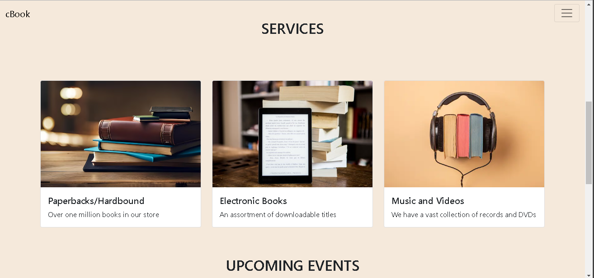

# cBook

|landing page                                |  landing page |
| ------------------------------------------ | ---------------------------------- |
|  |   |

Welcome to Nemadco academy's pahse1 website project! This is a cool place where you can find different kinds of books: audio, hardcopy and eBooks. Whether you like to listen, read or both, we have something for you. Browse our collection and enjoy!

## Table of Contents

- [Introduction](#cBook)
- [Getting Started](#getting-started)
- [Usage](#usage)
- [Contributing](#contributing)
- [License](#license)

## Getting Started

To get started with this project, you can clone the repository using the following command:

```
git clone https://github.com/Endework/Nedamco.git
```


## Usage 
You can create a free account and customize your profile with your favorite genres, authors, and reading habits. You can also browse our extensive catalog of books and discover new titles based on your preferences. Plus, you can join our book events and connect with other readers who share your passion. BookZone is more than just a website, it's a community of book enthusiasts.

### Built With

This section should list any major frameworks/libraries used to bootstrap your project. Leave any add-ons/plugins for the acknowledgements section. Here are a few examples.

* Html
* CSS
* JS
* Php
* VScode
* Bootstrap
  

## Contributing

Thank you for your interest in contributing to this project! At this time, I am not accepting contributions. However, I appreciate your support and encourage you to check back later for updates.

## License

